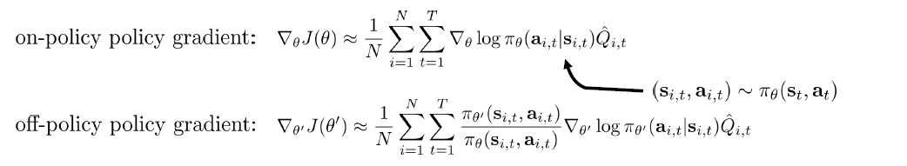

# Policy Gradient

> reference: [campusAI Policy gradient]([CampusAI](https://campusai.github.io/lectures/lecture5))

## Goal of RL

$$  
\mathop{argmax}\limits_{\theta}J(\theta) \\
J(\theta) = E_{\tau\sim p_{\theta}(\tau)}[r(\tau)] \\
\nabla_\theta{J(\theta)} = E_{\tau\sim p_\theta(\tau)}[(\sum_t^T \nabla_\theta log\pi_\theta(a_{it}|s_{it}))(\sum_t^T(r(s_t, a_t)))]
$$

after Monte Carlo

$$
\nabla_\theta J(\theta) = \frac{1}{N}\sum_i^N[(\sum_t^T\nabla_\theta log\pi_\theta
(a_{i,t}| s_{i,t}))(\sum_t^T{r(s_{i,t}, a_{i,t})})]
$$

## REINFORCE

1. sample  $\tau^i$  from  $\pi_{\theta}(a_t | s_t)$ -> directly run the policy 

2. $\nabla_{\theta} J(\theta) = \sum_{i}^N[\sum_{t}^T\nabla_{\theta} log\pi_\theta (a_{i,t}| s_{i,t})r(\tau)]$

3. $\theta \leftarrow \theta + \alpha \nabla_\theta J(\theta)$

>  注意：
> 
> 第2步中没有取平均，这是因为梯度是指代变化的方向，而变化的步长应该由learning rate来决定，所以在第3步中要乘$\alpha$ ，而不是在第2步中取$\frac{1}{N}$ 步长
> 
> 第3步中是+，这是gradient ascent，需要使long-term reward最大，所以每一步应该是增加

## Interpretation of REINFORCE

现在讨论REINFORCE step3：每次上升一小步就是在增大整个trajectory的概率，可以把$r(\tau)$ 看作是sign，如果$r(\tau)$ 是正/负的，就增加/减少整个trajectory的可能性。这样做会带来问题，下一部分解释。

## Issue

### 1. causality

我们改写一下gradient的形式

$$
\nabla_\theta J(\theta) = E_{\tau\sim p_\theta(\tau)}[\sum_t^T(\nabla_\theta
log \pi_\theta(a_t|s_t)\sum_t^Tr(s_t, a_t))]
$$

我们可以观察到 $\nabla_\theta log\pi_\theta(a_t | s_t)$ 乘上了整个trajectory的从第一步开始的reward之和，但是这就和我们的做出的假设不符合，我们是假设当前time-step不受之前time-step的reward的影响的，所以需要考虑causality。

**solution**

using `reward to go` 使用$\hat{Q}_t = \sum_{t=t'}^T r(s_t, a_t)$ 代替，最后式子变成

$$
\nabla_\theta J(\theta) = E_{\tau\sim p_\theta(\tau)}[\sum_t^T\nabla_\theta
log \pi_\theta(a_t|s_t)\hat{Q}_t]
$$

### baseline

> In the interpretation we said that the gradient steps increases the likelihood of trajectories with positive rewards and decreases the likelihood of those with negative rewards. Consider the case in which we have some trajectories with positive rewards, and some with negative rewards (in green in the figure). The action distribution is correctly pushed towards the trajectories with positive rewards. However, if we add an offset to the same rewards making them all positive without changing their scale (yellow in the figure), things change dramatically. Now, the gradient step is correctly pushing the action distribution towards the higher rewards, but it is also spreading it in the direction of the lower -but still positive- ones, since the gradient step is also increasing their likelihood.

**solution**

subtract any term b that does not depend on the trajectory $\tau$ 

$$
\nabla_\theta J(\theta) = \sum_i^N[\sum_t^T\nabla_\theta log\pi_\theta
(a_{i,t}| s_{i,t})(r(\tau) - b)] \\
b = \frac{1}{N}\sum_t^N r(\tau^i)
$$

## on-policy to off-policy

the Policy Gradient algorithm we talk above is on-policy which means we need generate new data samples after we use the previous data to update. Off-policy aims to reuse the past experience.

**Importance sampling**

$$
E_{x\sim p(x)}[f(x)] = E_{x\sim q(x)}[\frac{p(x)}{q(x)}f(x)]
$$

引入到policy gradient中：

$$
J(\theta') = E_{\tau \sim \pi_\theta(\tau)}[\frac{\pi_{\theta'}(\tau)}{\pi_\theta
(\tau)}r(\tau)] \\
\theta'\ is\ new
$$

最后可以化简得到（具体过程可以参考slides）

$$
\nabla_\theta' J(\theta') = E_{\tau \sim \pi_\theta}[\sum_{t=1}^T \nabla_{\theta'}
log \pi_{\theta'}(a_t | s_t)(\prod_{t=1}^T \frac{\pi_{\theta'}(a_t | s_t)}
{\pi_\theta(a_{t} | s_{t})})(\sum_{t=t'}^T r(s_{t}, a_{t})]
$$

after using Monte Carlo:



## Implement of PG

### PG with automatic differentiation

using cross entropy or squared error to compute $log \pi_\theta(a_{i,t} | s_{i,t})$

```python
# Given:
# actions -(N*T) x Da tensor of actions
# states -(N*T) x Ds tensor of states
# q_values - (N*T) x 1 tensor of estimated state action values
# Build the graph:
logits = policy.predictions(states) # This should return (N*T) x Da tensor of action logits
negative_likelihoods = tf.nn.softmax_cross_entropy_with_logits (labels=actions, logits=ligits)
weighted_negative_likelihoods = tf.multiply(negative_likelihoods , q_values)
loss = tf.reduce_mean(weighted_negative_likelihoods)
gradients = loss.gradients (loss, gradients)
```


# Actor-Critic

## 从policy gradient到policy evaluation

$$
\nabla_\theta J(\theta) \approx \frac{1}{N}\sum_i^N\sum_t^T
\nabla_\theta log\pi_\theta(a_{i,t} | s_{i,t})(Q(s_{i,t}, a_{i,t}) - V(s_{i,t}))
$$

理解Advantage function

$$
A(s_{i,t}, a_{i,t}) = Q(s_{i,t}, a_{i,t}) - V(s_{i,t})
$$

> 当前状态下采取动作a，比该状态下分别采取所有动作的期望的奖励值 高多少

实际中如何得到 $A(s_{i,t}, a_{i,t})$

$$
Q(s_{t}, a_{t}) = r(s_t, a_t) + V(s_{t+1}) \\
A(s_t, a_t) = r(s_t, a_t) + V(s_{t+1}) - V(s_t)
$$

这样我们只需要fit $V(s_t)$

为了fit $V(s_t)$ ,采用monte carlo

$$
V(s_t) \approx \frac{1}{N}\sum_i^N\sum_{t'=t}^Tr(s_{t'}, a_{t'})
$$

如此我们得到整个training 过程

> training data: $\{ (s_{i,t}; \sum_{t'=t}^T r(s_{i,t'}, a_{i, t'})\}$ 使用的是monte carlo target
> 
> prediction: $\hat{V_\phi^\pi(s_i)}$
> 
> ideal target : $r(s_{i,t}, a_{i,t}) + \hat{V_\phi^\pi(s_{i, t+1})}$

## policy evaluation 到 Actor-critic

> 1. sample $\{ s_i, a_i\}$ from $\pi_\theta(a|s)$
> 
> 2. update $\hat{V_\phi^\pi(s)}$ using target $r + \gamma \hat{V_\phi^\pi(s')}$
> 
> 3. evaluate $A(s_t, a_t) = r(s_t, a_t) + \gamma V(s_{t+1}) - V(s_t)$
> 
> 4. $\nabla_\theta J(\theta) \approx \sum_i \nabla_\theta log\pi_\theta(a_i|s_i)\hat{A^\pi(s_i, a_i)}$
> 
> 5. $\theta \leftarrow \theta + \alpha \nabla_\theta J(\theta)$
> 
> $y_{i,t} \approx r(s_{i,t}, a_{i,t}) + \gamma \hat{V_\phi^\pi(s_{i, t+1})}$
> 
> $\sum_i \nabla_\theta log\pi_\theta(a_i | s_i)$ 使用monte carlo近似 softmax_with_cross_entropy(actions, logits)
