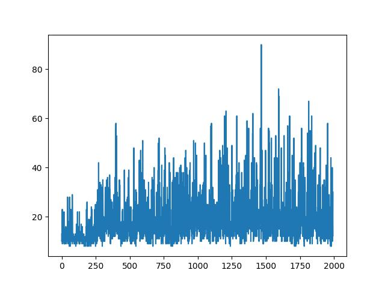

## Test
```bash
python3 env.py > log.txt
```

## Result


## Further thinking
RL is hard to converge. So in this test, I test 50000 episodes, and 
different hyperparameters and also try to optimize the net but the result is 
still bad.   
This project is mainly to help understand DQN.