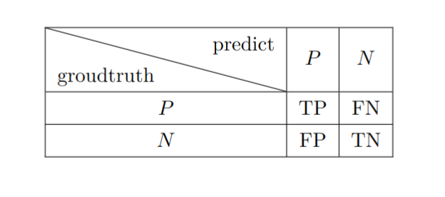
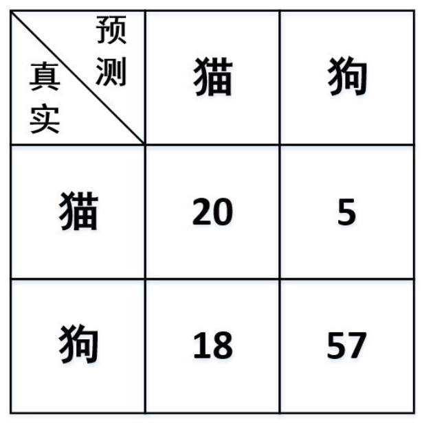

## Readings

1. [分词1](https://easyai.tech/ai-definition/tokenization/)
2. [分词评估](https://zhuanlan.zhihu.com/p/100552669)

## Brief introduction

文本是一些非结构化的数据，分词的目的就是将这些数据转化为结构化的数据。词是表达完整语义的最小单位，分词现在已经不一定是nlp任务的基础了[(is segmentation necessary)](https://arxiv.org/pdf/1905.05526.pdf)中文分词的三种基本方法：

1. 基于词典：
   1. 正向最大匹配
   2. 逆向最大匹配
   3. 双向匹配
2. 基于统计
   1. HMM
   2. CRF
   3. SVM
3. 基于深度学习
   1. LSTM+CRF

我本次实验实现的是基于词典的MMSEG算法，MMSEG算法是正向最大匹配的扩展

## Declaration

This repository contains my implementation of MMSEG algorithm which is a widely used Chinese segmentation algorithm. In this lab, I try Golang not Python.
I implement it according to MMSEG official site http://technology.chtsai.org/mmseg/
MMSEG is a simple but useful algorithm to solve Chinese segmentation problems. Although there are many new solutions for this task, but you can find them more or less influenced by MMSEG.

## Notes

### NLP分词效果的评估

分词的本质就是完成一个分类任务，所以可以借鉴分类任务的评估来衡量分词任务的效果。
有以下几个标准可以参考：

- accuracy, precision, recall, F-score
  用一个简单的图表来说明
  
  
  $$
  \begin{aligned}
  accuracy &= \frac{TP+TN}{TP+FP+FN+TN}\\
  precision &= \frac{TP}{TP+FP} \\
  recall &= \frac{TP}{TP+FN} \\
  F-score &= (1+\beta^2)\frac{precision*recall}{\beta^2*precision+recall} \\
  \end{aligned}
  $$

以图片分类问题中的一个例子来看[参考](https://zhuanlan.zhihu.com/p/100552669)   

$ accuracy = \frac{20+57}{20+18+5+7}$
$ precision = \frac{20}{20+18} $
$ recall = \frac{20}{20+5} $
$ F_1 = (1+1^2)*\frac{precision*recall}{1*precision+recall}$

**NLP的分词如何评估？**
NLP分词同样可以使用上面几个标准来评估，但是有所变化。  
假设我们的数据中有一个词组“武汉市长江大桥”，我们参考某个词典，可能会将其分为“武汉_市长_江大桥”，“武汉市_长江大桥”。我们用precision和recall来评估。  
数据集中已知这个分词的groudtruth为“武汉市_长江大桥”，我们结果写成分词区间的形式。“武汉市_长江大桥”:[1,3][4,7]；“武汉_市长_江大桥”:[1,2][3,4][5,7]。groudtruth的答案构成集合A作为P,其他情况均视为N。分词结果区间的集合为B。
groudtruth可以写成 $ TP \cup FN = A $
分词结果也就是对groudtruth的一个预测可以写成 $ TP \cup FP = B $
计算precision和recall:
1. $ precision = \frac{|A \cap B|}{|B|}$
2. $ recall = \frac{|A \cap B|}{|A|} $

在上面的例子中，“武汉_市长_江大桥”$ A \cap B = \emptyset$，“武汉市_长江大桥” $ A \cap B = [1,2][3,4][5,7] $， groudtruth $ A = [1,2][3,4][5,7]$ 。所以对于第一种分词结果$ precision=recall=0 $,第二种分词结果 $precision=\frac{3}{3}=1, recall=\frac{3}{3}=1 $

**针对分词任务**  
根据分词任务的特点而导出了OOV recall(out of vocabulary) 和IV recall(in vocabulary)。  
OOV的出现是考虑到产生了新词而词典没有收录或者是分词器产生了错误，IV可以衡量分词器对于已有的词的分词效果。  
$$ 
OOV recall = \frac{重复词区间未在词典中出现的词}{标准分词中未在词典中出现的词}
$$
  
$$ 
IV recall = \frac{重复词区间在词典中出现的词}{标准分词中在词典中出现的词}
$$
  
IV recall低代表分词器连词典中已经存在的词都无法很好分词，可能是消除歧义的能力较弱；OOV recall高代表分词器对于新词有一定的发现能力。

---

## reference

1. [kenzhengguan&#39;s implementation](https://github.com/kenzhengguan/gommseg)
2. MMSEG official implementation and I download source code, you can check in lab2/mmseg_official_code/
3. [more intuitive explanation of MMSEG](https://blog.csdn.net/HHyatt/article/details/6202826)
